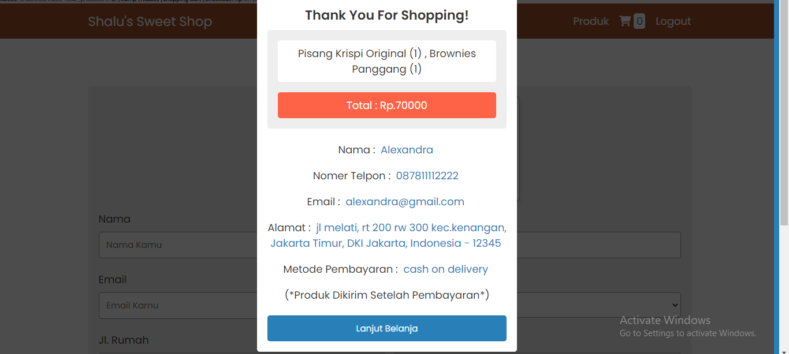

# Online-Shop-Application

# Deskripsi Aplikasi 
- Web ini merupakan proyek Tugas Based-Learning Matakuliah Pemrograman Web yang menuntut mahasiswa untuk mencari klien yang ingin memiliki platform online shop. Dengan fokus pada pengembangan keterampilan pemrograman web, mahasiswa diminta untuk merancang dan mengimplementasikan fitur-fitur esensial yang dibutuhkan dalam sebuah toko online. 
- Web ini adalah toko online yang menjual berbagai Cake and Pastry, Saya berdiskusi dengan klien dan akhirnya membuat 2 halaman yaitu halaman admin untuk manajemen produk dan halaman untuk pengguna yang ingin mengunjungi dan berbelanja Toko Online ini.

# Gambar Project 

- Halaman Admin 

- Halaman Pengguna

 
